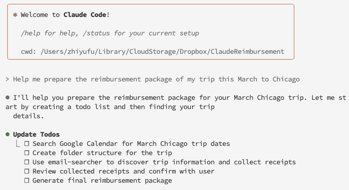
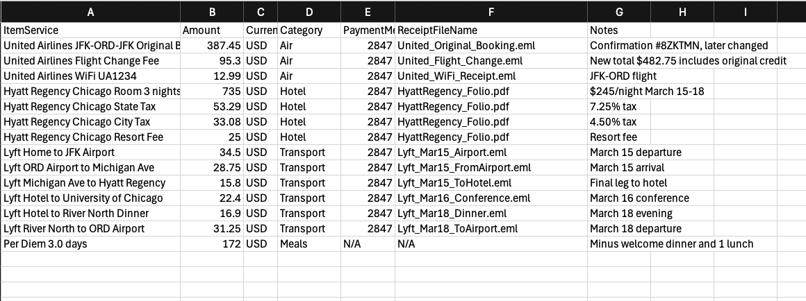
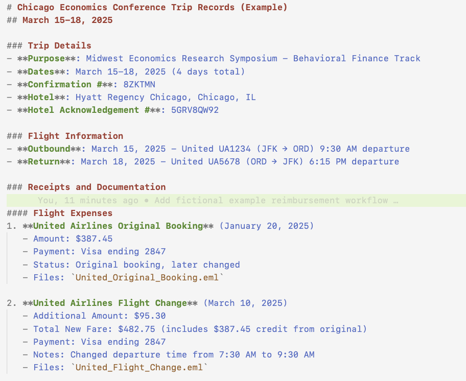

# Reimbursement Preparer with Claude Code

## What is this?

This is a fine-tuned workflow that instructs Claude Code to pull travel information from Gmail and Google Calendar, and compile a reimbursement package with expense breakdown and receipts. 

In short, you can do the following with minimal human intervention:

<div align="center">
  <!-- Top: Large first figure -->
  
  
  <!-- Down arrow -->
  <div style="font-size: 60px; color: #666; margin: 20px 0;">⬇️</div>
  
  <!-- Bottom: Two figures horizontally aligned -->
  <div style="display: flex; align-items: center; justify-content: center; gap: 40px;">
    
    
  </div>
</div>

(Information in this example is fictionalized based off a real reimbursement case)

## Who's this for?

I made this for my own personal use. But if you also:

- Are more tired of manually searching for and compiling travel receipts than playing around with LLMs
- Receive travel bookings and receipts in your Gmail
- Use Claude Code (Gemini or other LLM agents that support MCP may also work)

This may be handy for you as well. 

## Installation

First, clone this repository:

```bash
git clone https://github.com/FuZhiyu/ClaudeReimbursement.git
cd ClaudeReimbursement
```

Most of the heavy lifting is done by the Claude Code agent and two MCP servers:

2. Install [Gmail-MCP-Server](https://github.com/GongRzhe/Gmail-MCP-Server) and [Google-Calendar-MCP](https://github.com/nspady/google-calendar-mcp)

   - Follow the instructions in the repositories to install them on Claude Desktop and complete authentication
   - In terminal, run `claude mcp add-from-claude-desktop -s user` to add the MCP servers to your Claude Code configuration
3. Run `pip install -r requirements.txt` to install dependencies for the Python scripts

4. Set up Gmail API credentials for the Python gmail downloader script:
   - Create a `.env` file in the project root with:
     ```
     GMAIL_CREDENTIALS_PATH=/path/to/the/credentials/used/by/GmailMCP.json
     ```


## Usage

### Basic Workflow

1. **Start the Process:**: In Claude Code under the project folder, request:
   ```
   I need help filing a reimbursement for my trip in [date range] to [City] for [Conference/Purpose]
   ```

2. **Claude Code will automatically:**
   - Search your Google Calendar for trip dates
   - Create organized folder structure
   - Use email-searcher agent to find relevant travel information and receipts from your Gmail
   - Download and categorize expenses
   - Generate final reimbursement package

3. **Review and Submit**
   - Verify the generated `reimbursement_summary.tsv`
   - Check the `Receipts/` folder for supporting documents
   - Submit to your institution's reimbursement system, or ask Claude Code to "use the Gmail MCP to draft an email with the reimbursement package attached to my assistant"


### Example Output Structure
```
2025-03-Chicago-Conference/
├── records.md                     # Detailed trip documentation
├── reimbursement_summary.tsv      # Final expense summary
├── Receipts/                      # Supporting documents
│   ├── Flight_Booking.eml
│   ├── Hotel_Folio.pdf
│   └── Transport_Receipts.eml
└── records/                       # Original email downloads
    └── [email archives]
```


## Example

See the `2025-03-Chicago-Example/` folder for a complete fictional example showing:
- Detailed trip records with receipt documentation
- Final TSV summary with proper categorization
- Receipts folder with documents (empty for illustration)

## Details and Customization

The main workflow is written in natural language in the following files:

- `CLAUDE.md`: Main step-by-step instructions for Claude Code 
- `.claude/agents/email-searcher.md`: A sub-agent that uses the Gmail MCP server to search for information in your Gmail

These files are human-readable in the markdown format, and you can edit them to customize the workflow. Some instructions in `CLAUDE.md` might be institution-specific, and you can edit them to fit your needs.

**Why sub-agents?**: Searching through your Gmail can easily overwhelm the context window of the main agent, and most of the information is not relevant. Therefore, the sub-agent is used as an information filter for context window preservation.

The Python script `download_gmail_message.py` is used to download email messages from your Gmail. As of now, the read and download function of the Gmail MCP is limited. In the future it can be dropped. 